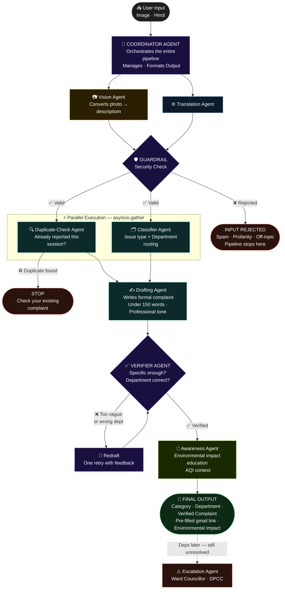

# DelhiteFix (DeF) — Transforming Delhi's Public Civic Complaints Filing Into an AI-Powered Pollution Fighter with Multi-Agent AI

DelhiteFix is an AI-powered civic complaint assistant for Delhi residents, built using Google's Agent Development Kit (ADK) and Gemini. It transforms informal, multi-lingual, and multi-modal resident inputs (English, Hindi, Hinglish, or photos) into structured, formally written, and correctly routed civic grievances.

---

## 🏗️ Multi-Agent Architecture

The solution uses an orchestrated multi-agent design consisting of a central coordinator and several specialized utility agents:


```

---

## 📁 Directory Structure

```text
delhitefix/
├── agents/
│   ├── classifier_agent/
│   │   └── agent.py
│   ├── coordinator_agent/
│   │   └── agent.py
│   ├── drafting_agent/
│   │   └── agent.py
│   ├── duplicate_check_agent/
│   │   └── agent.py
│   ├── escalation_agent/
│   │   └── agent.py
│   ├── translation_agent/
│   │   └── agent.py
│   ├── verifier_agent/
│   │   └── agent.py
│   ├── vision_agent/
│   │   └── agent.py
│   └── awareness_agent/
│       └── agent.py
├── skills/
│   └── civic-routing-skill/
│       └── SKILL.md
├── tests/
│   ├── run_scenario_tests.py
│   ├── test_agent.py
│   ├── test_guardrail.py
│   └── test_translation_vision.py
├── app.py                  # Gradio Web UI
├── guardrail.py            # Layered static & LLM validation
├── requirements.txt        # Project dependencies
└── README.md
```

---

## 🛠️ Setup Instructions

### 1. Create and Activate Virtual Environment
```bash
# Create venv
python -m venv .venv

# Activate (Windows PowerShell)
.venv\Scripts\Activate.ps1

# Activate (Windows CMD)
.venv\Scripts\activate.bat

# Activate (Linux/macOS)
source .venv/bin/activate
```

### 2. Install Dependencies
```bash
pip install -r requirements.txt
```

### 3. Configure Environment Variables
Create a `.env` file in the root directory and add your Gemini API key:
```env
GEMINI_API_KEY=YOUR_GEMINI_API_KEY
```

---

## 🚀 Running the App

### Web User Interface (Gradio)
Start the web interface using the local python executable:
```bash
python app.py
```
Open your browser and navigate to the address shown in the terminal (usually `http://127.0.0.1:7860`).

### Running the CLI Harness
To run predefined scenario workflows in the console:
```bash
python coordinator_loop.py
```

---

## 🧪 Running Tests

To verify individual parts of the pipeline, run the corresponding test script:
```bash
# Test agents configuration
python tests/test_agent.py

# Test guardrail rules
python tests/test_guardrail.py

# Test vision and translation functionality
python tests/test_translation_vision.py
```
